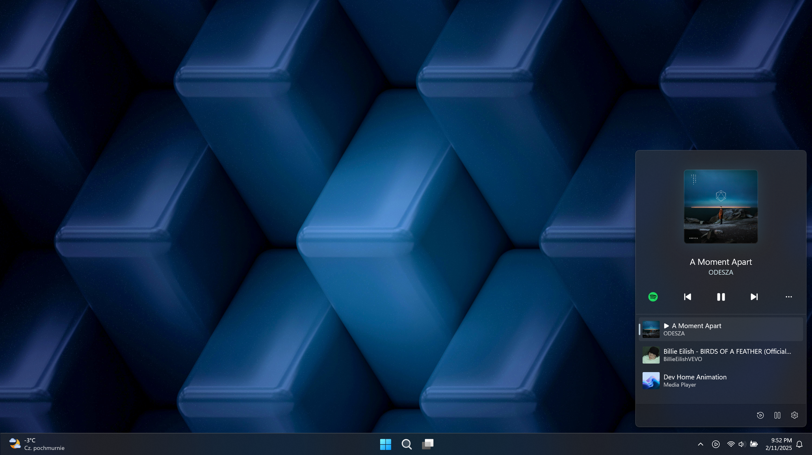

# Media Flyout

Media Flyout is a modern media control overlay for Windows 11 that lets you manage playback, shuffle, loop tracks, and switch between media apps with ease.

  

  

Feel free to share ideas about new features or report bugs.
